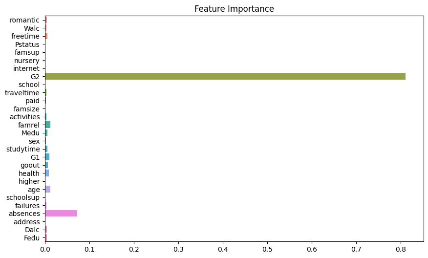
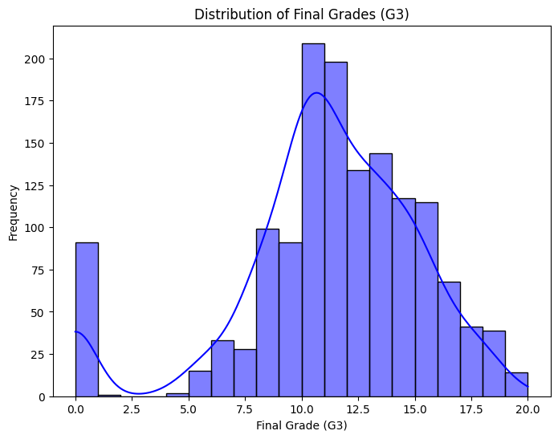
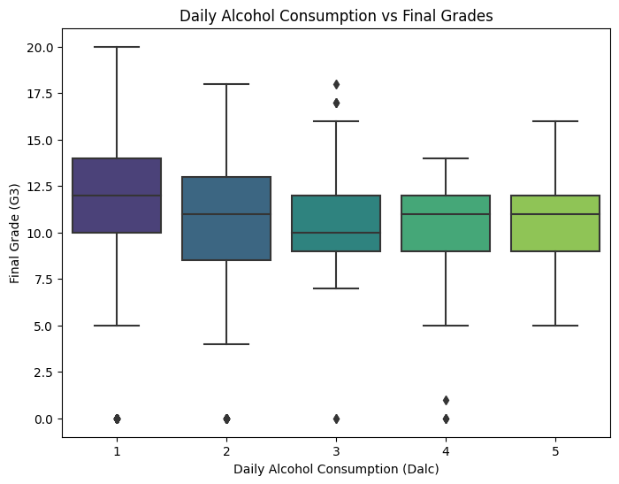
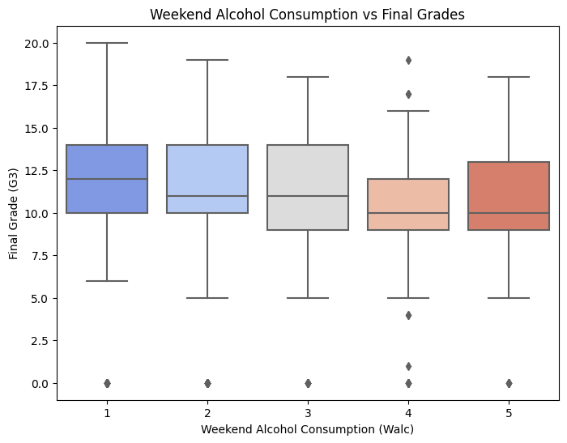
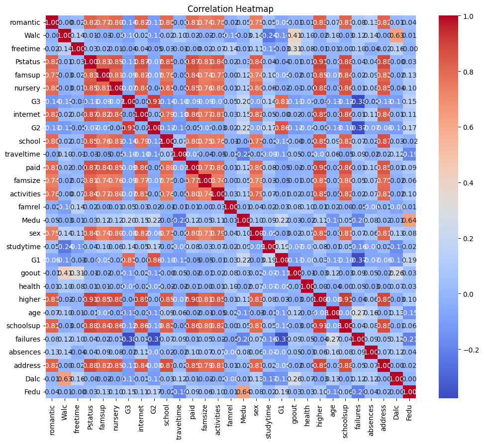

# 알코올 섭취량에 따른 학업성취도 예측
- 한 줄 설명
- youtube link
  
## Members
성연우 | 생명과학과 1학년 | syeonu818@gmail.com

임종호 | 기계공학부 1학년 | oscar0330@hanyang.ac.kr

## I. Proposal
   ### Motivation: why are you doing this? ###
   
   ### What do you want to see at the end? ###

## II. Datasets

총 두 가지 데이터셋을 활용하였다. 

   ### 1. Student Alcohol Consumption
   - 학생 정보와 알코올 섭취량, 이에 따른 학업 성취도를 일일이 수집하기에는 한계가 있으므로 kaggle에서 제공하는 데이터셋을 사용하였다. (https://www.kaggle.com/datasets/uciml/student-alcohol-consumption)
     
   - 해당 데이터는 두 포르투갈 학교의 중등교육 학생 성취도를 다룬다. Math course와 Portuguese language course를 수강하는 학생들의 기본 정보들과 알코올 섭취 정도, 3개 학기 성적을 포함한다.
     
   - 두 과목 모두 학생의 정보를 나타내는 30개의 열과 성적을 나타내는 3개의 열로 구성되어있으며, Math course의 경우 395개, Portuguese language course의 경우 649개의 데이터셋으로 구성되어있다.

    
  ### 2. Frequency & percentage of alcohol consumption of Austrailian university students

- The association between levels of alcohol consumption and mental health problems and academic performance among young university students (https://journals.plos.org/plosone/article?id=10.1371/journal.pone.0178142) 에 있는 **alcohol consumption level (학생별 알코올 섭취 수준)** 데이터를 사용하였다.

- 2518명의 학생의 알코올 섭취 수준에 대한 빈도(frequency)와 백분율(percentage)를 나타내는 데이터이며, 개별 학생 데이터는 포함하지 않는다.

--------

- 이 두 데이터를 결합하기 위해 2번 데이터셋을 학생별 알코올 섭취 수준을 분류하는 기준으로 설정하고, 1번 데이터셋에 학생별 알코올 섭취 수준을 할당하였다. 
  
- (1번) kaggle 데이터셋에서 Dalc 와 Walc는 각각 주중과 주말에 섭취한 알코올 양을 의미한다. 두 값의 평균을 구하여 그 값이 속하는 범위에 따라 알코올 섭취 정도를 low-level, hazardous-level, harmful-level 로 정의하였다.
  
- kaggle 데이터셋에서 알코올 섭취 정도를 1(아주 낮음)에서 5(아주 높음)까지 정수로 표현하였다.

- 이에 따라 low-level / hazardous-level / harmful-level의 범위는 각각 1.0 ~ 2.33 / 2.34 ~ 3.67 / 3.68 ~ 5.0 으로, 1.0 에서 5.0 까지의 범위를 3등분하여 설정하였다.
    
  - 위와 같이 <ins>(1) 단순히 범위 기반</ins>으로 설정할 수 있고 이외에도 <ins>(2) 분포에 기반</ins>하여 경계값을 설정하거나 <ins>(3) 분위수에 기반</ins>하여 경계값을 설정할 수 있다. 단순 범위 기반의 경우 빠르고 간단한 분석에 적합하며 현재 상황에서 충분히 유용하다고 판단하여 단순 범위 기반으로 경계값을 정하였다. 


## III. Methodology
   - Randomforest를 사용하여 학생의 알코올 섭취 및 성적 데이터 분석, 예측
   - 학생의 성적 데이터를 기반으로 예측 모델을 생성.
   - 전처리, 학습, 평가의 전체 머신러닝 파이프라인을 보여주며, 결과적으로 randomforest 모델을 사용하여 학생 성적(G3)을 예측함. 


```python
import pandas as pd
import numpy as np
from sklearn.model_selection import train_test_split
from sklearn.preprocessing import LabelEncoder, MinMaxScaler
from tensorflow.keras.models import Sequential
from tensorflow.keras.layers import Dense, Dropout
```

- pandas: 데이터 조작 및 분석을 위한 라이브러리
          데이터프레임 형식으로 데이터를 불러오고, 정리하여 분석하는데 사용함.

- numpy: 수치 계산 및 데이터 처리를 위한 라이브러리
         다양한 수학 함수를 제공. 수치 연산, 배열 및 행렬 연산에 사용함.

- sklearn 모듈: 머신러닝 작업을 위해 다양한 모델 및 유틸리티 제공
  
  - train_test_split: 데이터를 학습 세트와 테스트 세트로 나누는 함수.
                      모델 학습 및 평가를 위해 데이터를 분리함.
  
  - LabelEncoder: 카테고리형 데이터를 숫자로 변환하는 도구.
                  텍스트 기반의 범주형 데이터를 머신러닝 모델에 입력할 수 있는 숫자형 데이터로 변환.
  
  - MinMaxScaler: 데이터의 값을 특정 범위로(기본적으로 0~1)로 스케일링함.
                  feature scaling을 통해 모델 학습을 안정화시킴.

    * feature scaling: 데이터의 각 특성(feature)이 서로 다른 단위를 가질 때, 이를 동일한 범위로 변환하여 머신러닝 알고리즘의 성능을 향상시키는 과정
    
- TensorFlow 모듈: 오픈 소스 머신러닝 및 딥러닝 라이브러리.
  
- Keras 모듈: 딥러닝 모델을 쉽게 구축하고 훈련할 수 있도록 설계된 딥러닝 라이브러리. TensorFlow 같은 딥러닝 프레임워크 위에서 동작함.
  
  - Sequential: 계층(layer)을 순차적으로 쌓아 신경망 모델을 생성.
                딥러닝 모델을 정의함.
  
  - Dense: 완전 연결 계층(Fully Connected Layer).
           신경망의 기본 계층으로, 각 노드가 이전 계층의 모든 노드와 연결됨.
    
  - Dropout: 과적합(overfitting)을 방지하기 위해 일부 뉴런을 무작위로 비활성화하는 계층.
             모델의 일반화 성능을 향상시키는데 사용.

```python
# 1. 데이터셋 로드
math_df = pd.read_csv('/kaggle/input/student-alcohol-consumption/student-mat.csv')
por_df = pd.read_csv('/kaggle/input/student-alcohol-consumption/student-por.csv')
```
```python
# 알코올 소비 데이터 (수준별 빈도 데이터)
alcohol_levels = {
    "low level": {"Frequency": 1054, "Percentage": 55.9},
    "hazardous level": {"Frequency": 679, "Percentage": 36.0},
    "harmful level": {"Frequency": 154, "Percentage": 8.2}
}
```
```python
# 2. 수학 및 포르투갈어 데이터셋 병합
students_df = pd.concat([math_df, por_df], ignore_index=True)
```
```python
# 3. 알코올 소비 수준 분류
def classify_alcohol_level(dalc, walc):
    avg_alcohol = (dalc + walc) / 2
    if avg_alcohol <= 2.0:
        return "low level"
    elif avg_alcohol <= 3.5:
        return "hazardous level"
    else:
        return "harmful level"

students_df['alcohol_level'] = students_df.apply(lambda x: classify_alcohol_level(x['Dalc'], x['Walc']), axis=1)
```
```python
# 4. 범주형 변수 인코딩
label_columns = ['school', 'sex', 'address', 'famsize', 'Pstatus', 'Mjob', 'Fjob', 'reason', 'guardian', 'schoolsup', 'famsup', 'paid', 'activities', 'nursery', 'higher', 'internet', 'romantic']
label_encoder = LabelEncoder()

for col in label_columns:
    students_df[col] = label_encoder.fit_transform(students_df[col])
```
```python
# 5. 수치형 변수 정규화
numerical_columns = ['age', 'Medu', 'Fedu', 'traveltime', 'studytime', 'failures', 'famrel', 'freetime', 'goout', 'Dalc', 'Walc', 'health', 'absences', 'G1', 'G2']
scaler = MinMaxScaler()

students_df[numerical_columns] = scaler.fit_transform(students_df[numerical_columns])
```
```python
# 6. 특성과 타겟 설정
x = students_df.drop(columns=['G3', 'alcohol_level'])  # G3는 최종 성적, alcohol_level은 보조 정보
y = students_df['G3']  # 타겟 변수 (최종 성적)
```
```python
# 7. 데이터 분할
x_train, x_test, y_train, y_test = train_test_split(x, y, test_size=0.2, random_state=42)
```
```python
# 8. 딥러닝 모델 생성
model = Sequential()
model.add(Dense(128, input_dim=x_train.shape[1], activation='relu'))
model.add(Dropout(0.2))
model.add(Dense(64, activation='relu'))
model.add(Dropout(0.2))
model.add(Dense(32, activation='relu'))
model.add(Dense(1, activation='linear'))  # 회귀 문제이므로 선형 활성화 함수 사용

model.compile(optimizer='adam', loss='mean_squared_error', metrics=['mae'])
```
```python
# 9. 모델 학습
model.fit(x_train, y_train, epochs=50, batch_size=32, validation_split=0.2)
```
```python
# 10. 모델 평가
loss, mae = model.evaluate(x_test, y_test)
print(f'테스트 세트에서의 평균 절대 오차 (MAE): {mae}')
```


## IV. Evaluation & Analysis











## V. Related Work 
## VI. Conclusion: Discussion
