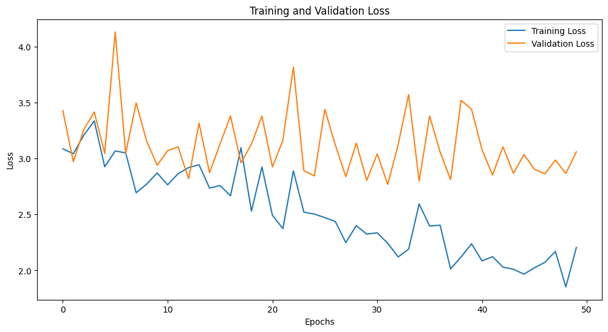
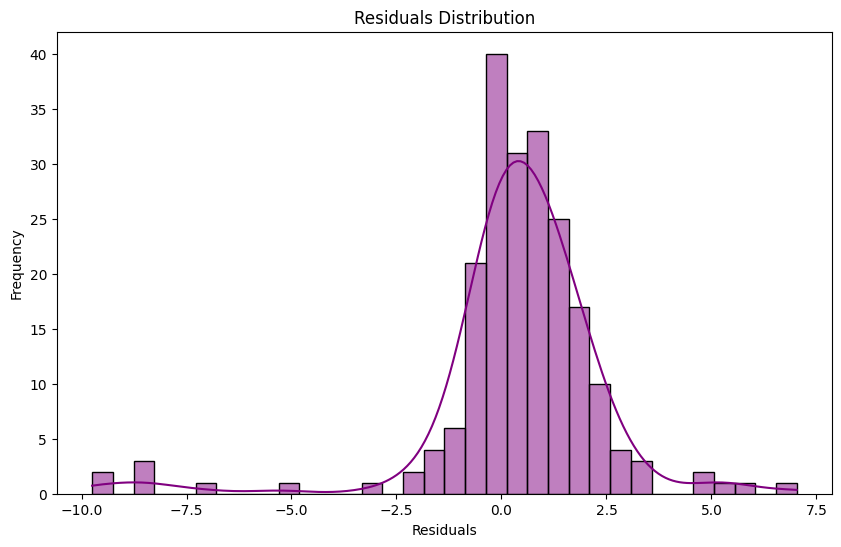
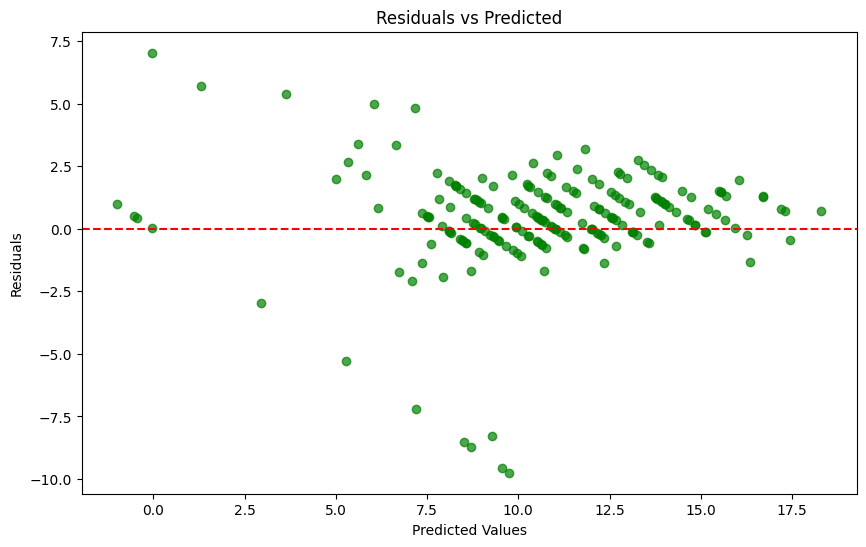
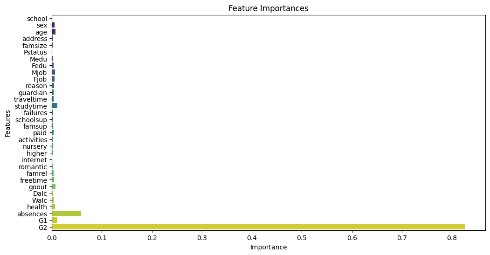

```python
import pandas as pd
import numpy as np
import matplotlib.pyplot as plt
import seaborn as sns
from sklearn.model_selection import train_test_split
from sklearn.preprocessing import LabelEncoder, MinMaxScaler
from sklearn.ensemble import RandomForestRegressor  
from sklearn.metrics import mean_squared_error, r2_score
from tensorflow.keras.models import Sequential
from tensorflow.keras.layers import Dense, Dropout

# 1. 데이터셋 로드
math_df = pd.read_csv('/kaggle/input/student-alcohol-consumption/student-mat.csv')
por_df = pd.read_csv('/kaggle/input/student-alcohol-consumption/student-por.csv')

# 알코올 소비 데이터 (수준별 빈도 데이터)
alcohol_levels = {
    "low level": {"Frequency": 1054, "Percentage": 55.9},
    "hazardous level": {"Frequency": 679, "Percentage": 36.0},
    "harmful level": {"Frequency": 154, "Percentage": 8.2}
}

# 2. 수학 및 포르투갈어 데이터셋 병합
students_df = pd.concat([math_df, por_df], ignore_index=True)

# 3. 알코올 소비 수준 분류
def classify_alcohol_level(dalc, walc):
    avg_alcohol = (dalc + walc) / 2
    if avg_alcohol <= 2.0:
        return "low level"
    elif avg_alcohol <= 3.5:
        return "hazardous level"
    else:
        return "harmful level"

students_df['alcohol_level'] = students_df.apply(lambda x: classify_alcohol_level(x['Dalc'], x['Walc']), axis=1)

# 4. 범주형 변수 인코딩
label_columns = ['school', 'sex', 'address', 'famsize', 'Pstatus', 'Mjob', 'Fjob', 'reason', 'guardian', 'schoolsup', 'famsup', 'paid', 'activities', 'nursery', 'higher', 'internet', 'romantic']
label_encoder = LabelEncoder()

for col in label_columns:
    students_df[col] = label_encoder.fit_transform(students_df[col])

# 5. 수치형 변수 정규화
numerical_columns = ['age', 'Medu', 'Fedu', 'traveltime', 'studytime', 'failures', 'famrel', 'freetime', 'goout', 'Dalc', 'Walc', 'health', 'absences', 'G1', 'G2']
scaler = MinMaxScaler()

students_df[numerical_columns] = scaler.fit_transform(students_df[numerical_columns])

# 6. 특성과 타겟 설정
x = students_df.drop(columns=['G3', 'alcohol_level'])  # G3는 최종 성적, alcohol_level은 보조 정보
y = students_df['G3']  # 타겟 변수 (최종 성적)

# 7. 데이터 분할
x_train, x_test, y_train, y_test = train_test_split(x, y, test_size=0.2, random_state=42)

# 8. 딥러닝 모델 생성
model = Sequential()
model.add(Dense(128, input_dim=x_train.shape[1], activation='relu'))
model.add(Dropout(0.2))
model.add(Dense(64, activation='relu'))
model.add(Dropout(0.2))
model.add(Dense(32, activation='relu'))
model.add(Dense(1, activation='linear'))  # 회귀 문제이므로 선형 활성화 함수 사용

model.compile(optimizer='adam', loss='mean_squared_error', metrics=['mae'])

# 9. 모델 학습
model.fit(x_train, y_train, epochs=50, batch_size=32, validation_split=0.2)

# 10. 모델 평가
loss, mae = model.evaluate(x_test, y_test)
print(f'테스트 세트에서의 평균 절대 오차 (MAE): {mae}')


```

    /opt/conda/lib/python3.10/site-packages/keras/src/layers/core/dense.py:87: UserWarning: Do not pass an `input_shape`/`input_dim` argument to a layer. When using Sequential models, prefer using an `Input(shape)` object as the first layer in the model instead.
      super().__init__(activity_regularizer=activity_regularizer, **kwargs)
    

    Epoch 1/50
    21/21 ━━━━━━━━━━━━━━━━━━━━ 2s 12ms/step - loss: 130.3378 - mae: 10.8137 - val_loss: 59.7018 - val_mae: 7.2122
    Epoch 2/50
    21/21 ━━━━━━━━━━━━━━━━━━━━ 0s 4ms/step - loss: 36.0690 - mae: 5.1057 - val_loss: 16.9924 - val_mae: 3.0086
    Epoch 3/50
    21/21 ━━━━━━━━━━━━━━━━━━━━ 0s 4ms/step - loss: 17.3857 - mae: 3.1216 - val_loss: 15.6930 - val_mae: 3.0686
    Epoch 4/50
    21/21 ━━━━━━━━━━━━━━━━━━━━ 0s 4ms/step - loss: 16.6488 - mae: 2.9801 - val_loss: 14.1513 - val_mae: 2.8616
    Epoch 5/50
    21/21 ━━━━━━━━━━━━━━━━━━━━ 0s 4ms/step - loss: 14.8854 - mae: 2.9245 - val_loss: 12.5039 - val_mae: 2.5817
    Epoch 6/50
    21/21 ━━━━━━━━━━━━━━━━━━━━ 0s 4ms/step - loss: 14.0757 - mae: 2.6788 - val_loss: 11.2631 - val_mae: 2.3911
    Epoch 7/50
    21/21 ━━━━━━━━━━━━━━━━━━━━ 0s 4ms/step - loss: 11.8539 - mae: 2.5345 - val_loss: 10.0472 - val_mae: 2.2427
    Epoch 8/50
    21/21 ━━━━━━━━━━━━━━━━━━━━ 0s 4ms/step - loss: 10.1668 - mae: 2.3224 - val_loss: 8.8343 - val_mae: 2.0889
    Epoch 9/50
    21/21 ━━━━━━━━━━━━━━━━━━━━ 0s 4ms/step - loss: 10.3444 - mae: 2.3613 - val_loss: 7.8178 - val_mae: 1.9089
    Epoch 10/50
    21/21 ━━━━━━━━━━━━━━━━━━━━ 0s 4ms/step - loss: 7.9027 - mae: 2.0665 - val_loss: 7.1802 - val_mae: 1.8631
    Epoch 11/50
    21/21 ━━━━━━━━━━━━━━━━━━━━ 0s 4ms/step - loss: 8.1523 - mae: 2.1214 - val_loss: 7.6736 - val_mae: 2.1304
    Epoch 12/50
    21/21 ━━━━━━━━━━━━━━━━━━━━ 0s 4ms/step - loss: 7.3540 - mae: 1.9941 - val_loss: 5.9143 - val_mae: 1.6782
    Epoch 13/50
    21/21 ━━━━━━━━━━━━━━━━━━━━ 0s 4ms/step - loss: 7.2386 - mae: 1.9086 - val_loss: 5.5328 - val_mae: 1.6529
    Epoch 14/50
    21/21 ━━━━━━━━━━━━━━━━━━━━ 0s 4ms/step - loss: 6.7115 - mae: 1.9000 - val_loss: 5.0241 - val_mae: 1.3944
    Epoch 15/50
    21/21 ━━━━━━━━━━━━━━━━━━━━ 0s 5ms/step - loss: 7.6916 - mae: 1.8989 - val_loss: 4.7921 - val_mae: 1.3649
    Epoch 16/50
    21/21 ━━━━━━━━━━━━━━━━━━━━ 0s 4ms/step - loss: 5.6283 - mae: 1.7649 - val_loss: 4.5347 - val_mae: 1.3374
    Epoch 17/50
    21/21 ━━━━━━━━━━━━━━━━━━━━ 0s 5ms/step - loss: 5.0785 - mae: 1.6818 - val_loss: 5.1888 - val_mae: 1.6852
    Epoch 18/50
    21/21 ━━━━━━━━━━━━━━━━━━━━ 0s 4ms/step - loss: 5.6308 - mae: 1.7125 - val_loss: 4.3002 - val_mae: 1.3605
    Epoch 19/50
    21/21 ━━━━━━━━━━━━━━━━━━━━ 0s 4ms/step - loss: 5.5904 - mae: 1.6965 - val_loss: 3.9883 - val_mae: 1.2919
    Epoch 20/50
    21/21 ━━━━━━━━━━━━━━━━━━━━ 0s 4ms/step - loss: 5.4850 - mae: 1.7463 - val_loss: 3.9052 - val_mae: 1.2580
    Epoch 21/50
    21/21 ━━━━━━━━━━━━━━━━━━━━ 0s 4ms/step - loss: 4.5161 - mae: 1.6133 - val_loss: 4.0861 - val_mae: 1.3591
    Epoch 22/50
    21/21 ━━━━━━━━━━━━━━━━━━━━ 0s 4ms/step - loss: 5.8365 - mae: 1.7403 - val_loss: 3.9079 - val_mae: 1.2674
    Epoch 23/50
    21/21 ━━━━━━━━━━━━━━━━━━━━ 0s 4ms/step - loss: 4.7631 - mae: 1.6283 - val_loss: 4.1502 - val_mae: 1.4182
    Epoch 24/50
    21/21 ━━━━━━━━━━━━━━━━━━━━ 0s 4ms/step - loss: 4.3055 - mae: 1.5299 - val_loss: 3.9395 - val_mae: 1.3621
    Epoch 25/50
    21/21 ━━━━━━━━━━━━━━━━━━━━ 0s 4ms/step - loss: 4.4406 - mae: 1.5378 - val_loss: 3.8079 - val_mae: 1.3120
    Epoch 26/50
    21/21 ━━━━━━━━━━━━━━━━━━━━ 0s 4ms/step - loss: 4.1310 - mae: 1.5379 - val_loss: 3.6492 - val_mae: 1.1983
    Epoch 27/50
    21/21 ━━━━━━━━━━━━━━━━━━━━ 0s 4ms/step - loss: 4.6762 - mae: 1.5721 - val_loss: 3.7958 - val_mae: 1.3055
    Epoch 28/50
    21/21 ━━━━━━━━━━━━━━━━━━━━ 0s 4ms/step - loss: 4.3068 - mae: 1.5097 - val_loss: 4.0919 - val_mae: 1.4326
    Epoch 29/50
    21/21 ━━━━━━━━━━━━━━━━━━━━ 0s 4ms/step - loss: 4.3148 - mae: 1.5535 - val_loss: 3.7135 - val_mae: 1.2589
    Epoch 30/50
    21/21 ━━━━━━━━━━━━━━━━━━━━ 0s 4ms/step - loss: 3.7185 - mae: 1.4152 - val_loss: 3.6529 - val_mae: 1.2564
    Epoch 31/50
    21/21 ━━━━━━━━━━━━━━━━━━━━ 0s 4ms/step - loss: 3.9994 - mae: 1.4894 - val_loss: 3.5487 - val_mae: 1.1863
    Epoch 32/50
    21/21 ━━━━━━━━━━━━━━━━━━━━ 0s 4ms/step - loss: 3.6937 - mae: 1.4586 - val_loss: 4.0845 - val_mae: 1.4653
    Epoch 33/50
    21/21 ━━━━━━━━━━━━━━━━━━━━ 0s 4ms/step - loss: 4.0342 - mae: 1.5139 - val_loss: 3.5843 - val_mae: 1.2226
    Epoch 34/50
    21/21 ━━━━━━━━━━━━━━━━━━━━ 0s 4ms/step - loss: 3.5289 - mae: 1.3577 - val_loss: 3.6754 - val_mae: 1.3106
    Epoch 35/50
    21/21 ━━━━━━━━━━━━━━━━━━━━ 0s 4ms/step - loss: 3.5610 - mae: 1.4226 - val_loss: 4.1897 - val_mae: 1.5158
    Epoch 36/50
    21/21 ━━━━━━━━━━━━━━━━━━━━ 0s 4ms/step - loss: 3.5670 - mae: 1.4428 - val_loss: 3.5349 - val_mae: 1.2469
    Epoch 37/50
    21/21 ━━━━━━━━━━━━━━━━━━━━ 0s 4ms/step - loss: 3.5415 - mae: 1.4686 - val_loss: 3.3576 - val_mae: 1.1672
    Epoch 38/50
    21/21 ━━━━━━━━━━━━━━━━━━━━ 0s 4ms/step - loss: 3.8394 - mae: 1.4509 - val_loss: 3.5503 - val_mae: 1.3087
    Epoch 39/50
    21/21 ━━━━━━━━━━━━━━━━━━━━ 0s 4ms/step - loss: 3.4342 - mae: 1.4068 - val_loss: 3.2564 - val_mae: 1.1680
    Epoch 40/50
    21/21 ━━━━━━━━━━━━━━━━━━━━ 0s 4ms/step - loss: 4.3985 - mae: 1.5751 - val_loss: 3.3104 - val_mae: 1.1774
    Epoch 41/50
    21/21 ━━━━━━━━━━━━━━━━━━━━ 0s 4ms/step - loss: 3.4589 - mae: 1.3760 - val_loss: 3.1465 - val_mae: 1.1900
    Epoch 42/50
    21/21 ━━━━━━━━━━━━━━━━━━━━ 0s 4ms/step - loss: 3.1858 - mae: 1.3754 - val_loss: 3.2081 - val_mae: 1.1693
    Epoch 43/50
    21/21 ━━━━━━━━━━━━━━━━━━━━ 0s 4ms/step - loss: 3.8225 - mae: 1.4545 - val_loss: 3.2920 - val_mae: 1.2117
    Epoch 44/50
    21/21 ━━━━━━━━━━━━━━━━━━━━ 0s 4ms/step - loss: 3.7109 - mae: 1.4697 - val_loss: 3.1224 - val_mae: 1.1605
    Epoch 45/50
    21/21 ━━━━━━━━━━━━━━━━━━━━ 0s 4ms/step - loss: 3.6461 - mae: 1.4285 - val_loss: 3.7734 - val_mae: 1.4245
    Epoch 46/50
    21/21 ━━━━━━━━━━━━━━━━━━━━ 0s 4ms/step - loss: 3.3073 - mae: 1.3987 - val_loss: 3.1257 - val_mae: 1.1549
    Epoch 47/50
    21/21 ━━━━━━━━━━━━━━━━━━━━ 0s 4ms/step - loss: 3.1585 - mae: 1.3835 - val_loss: 3.1464 - val_mae: 1.1910
    Epoch 48/50
    21/21 ━━━━━━━━━━━━━━━━━━━━ 0s 4ms/step - loss: 3.3855 - mae: 1.3670 - val_loss: 3.1086 - val_mae: 1.1377
    Epoch 49/50
    21/21 ━━━━━━━━━━━━━━━━━━━━ 0s 4ms/step - loss: 3.1585 - mae: 1.3230 - val_loss: 3.1864 - val_mae: 1.2112
    Epoch 50/50
    21/21 ━━━━━━━━━━━━━━━━━━━━ 0s 4ms/step - loss: 3.4061 - mae: 1.3644 - val_loss: 3.5613 - val_mae: 1.3638
    7/7 ━━━━━━━━━━━━━━━━━━━━ 0s 2ms/step - loss: 4.1668 - mae: 1.3738 
    테스트 세트에서의 평균 절대 오차 (MAE): 1.4454330205917358
    


```python
# 학습 과정 시각화
history = model.fit(x_train, y_train, epochs=50, batch_size=32, validation_split=0.2)

# 학습과 검증 손실 그래프
plt.figure(figsize=(12, 6))
plt.plot(history.history['loss'], label='Training Loss')
plt.plot(history.history['val_loss'], label='Validation Loss')
plt.title('Training and Validation Loss')
plt.xlabel('Epochs')
plt.ylabel('Loss')
plt.legend()
plt.show()

# 학습과 검증 MAE 그래프
plt.figure(figsize=(12, 6))
plt.plot(history.history['mae'], label='Training MAE')
plt.plot(history.history['val_mae'], label='Validation MAE')
plt.title('Training and Validation MAE')
plt.xlabel('Epochs')
plt.ylabel('Mean Absolute Error')
plt.legend()
plt.show()

```

    Epoch 1/50
    21/21 ━━━━━━━━━━━━━━━━━━━━ 0s 6ms/step - loss: 2.9067 - mae: 1.3217 - val_loss: 3.4273 - val_mae: 1.3154
    Epoch 2/50
    21/21 ━━━━━━━━━━━━━━━━━━━━ 0s 4ms/step - loss: 2.8738 - mae: 1.2977 - val_loss: 2.9707 - val_mae: 1.1213
    Epoch 3/50
    21/21 ━━━━━━━━━━━━━━━━━━━━ 0s 4ms/step - loss: 3.4651 - mae: 1.4010 - val_loss: 3.2560 - val_mae: 1.2613
    Epoch 4/50
    21/21 ━━━━━━━━━━━━━━━━━━━━ 0s 3ms/step - loss: 3.2868 - mae: 1.3603 - val_loss: 3.4151 - val_mae: 1.3080
    Epoch 5/50
    21/21 ━━━━━━━━━━━━━━━━━━━━ 0s 5ms/step - loss: 2.6663 - mae: 1.2717 - val_loss: 3.0438 - val_mae: 1.1632
    Epoch 6/50
    21/21 ━━━━━━━━━━━━━━━━━━━━ 0s 4ms/step - loss: 3.0227 - mae: 1.3089 - val_loss: 4.1294 - val_mae: 1.5880
    Epoch 7/50
    21/21 ━━━━━━━━━━━━━━━━━━━━ 0s 4ms/step - loss: 3.1470 - mae: 1.3235 - val_loss: 3.0462 - val_mae: 1.1217
    Epoch 8/50
    21/21 ━━━━━━━━━━━━━━━━━━━━ 0s 4ms/step - loss: 2.6016 - mae: 1.2411 - val_loss: 3.4957 - val_mae: 1.3630
    Epoch 9/50
    21/21 ━━━━━━━━━━━━━━━━━━━━ 0s 4ms/step - loss: 2.9802 - mae: 1.3014 - val_loss: 3.1540 - val_mae: 1.2172
    Epoch 10/50
    21/21 ━━━━━━━━━━━━━━━━━━━━ 0s 4ms/step - loss: 2.8155 - mae: 1.2957 - val_loss: 2.9389 - val_mae: 1.0669
    Epoch 11/50
    21/21 ━━━━━━━━━━━━━━━━━━━━ 0s 4ms/step - loss: 2.7027 - mae: 1.2660 - val_loss: 3.0697 - val_mae: 1.1861
    Epoch 12/50
    21/21 ━━━━━━━━━━━━━━━━━━━━ 0s 4ms/step - loss: 2.9839 - mae: 1.3058 - val_loss: 3.1039 - val_mae: 1.2108
    Epoch 13/50
    21/21 ━━━━━━━━━━━━━━━━━━━━ 0s 4ms/step - loss: 3.0338 - mae: 1.3118 - val_loss: 2.8180 - val_mae: 1.0999
    Epoch 14/50
    21/21 ━━━━━━━━━━━━━━━━━━━━ 0s 4ms/step - loss: 2.5967 - mae: 1.2597 - val_loss: 3.3151 - val_mae: 1.2831
    Epoch 15/50
    21/21 ━━━━━━━━━━━━━━━━━━━━ 0s 4ms/step - loss: 2.7984 - mae: 1.2952 - val_loss: 2.8722 - val_mae: 1.0711
    Epoch 16/50
    21/21 ━━━━━━━━━━━━━━━━━━━━ 0s 4ms/step - loss: 2.5670 - mae: 1.2321 - val_loss: 3.1281 - val_mae: 1.2091
    Epoch 17/50
    21/21 ━━━━━━━━━━━━━━━━━━━━ 0s 5ms/step - loss: 2.4918 - mae: 1.2205 - val_loss: 3.3790 - val_mae: 1.3219
    Epoch 18/50
    21/21 ━━━━━━━━━━━━━━━━━━━━ 0s 4ms/step - loss: 3.1072 - mae: 1.3261 - val_loss: 2.9608 - val_mae: 1.0582
    Epoch 19/50
    21/21 ━━━━━━━━━━━━━━━━━━━━ 0s 4ms/step - loss: 2.6081 - mae: 1.2319 - val_loss: 3.1287 - val_mae: 1.2273
    Epoch 20/50
    21/21 ━━━━━━━━━━━━━━━━━━━━ 0s 4ms/step - loss: 3.1438 - mae: 1.3930 - val_loss: 3.3787 - val_mae: 1.3070
    Epoch 21/50
    21/21 ━━━━━━━━━━━━━━━━━━━━ 0s 4ms/step - loss: 2.7546 - mae: 1.2606 - val_loss: 2.9235 - val_mae: 1.1152
    Epoch 22/50
    21/21 ━━━━━━━━━━━━━━━━━━━━ 0s 4ms/step - loss: 2.3484 - mae: 1.1983 - val_loss: 3.1632 - val_mae: 1.2196
    Epoch 23/50
    21/21 ━━━━━━━━━━━━━━━━━━━━ 0s 4ms/step - loss: 3.0310 - mae: 1.3301 - val_loss: 3.8143 - val_mae: 1.4954
    Epoch 24/50
    21/21 ━━━━━━━━━━━━━━━━━━━━ 0s 4ms/step - loss: 2.7098 - mae: 1.2362 - val_loss: 2.8902 - val_mae: 1.0342
    Epoch 25/50
    21/21 ━━━━━━━━━━━━━━━━━━━━ 0s 4ms/step - loss: 2.3864 - mae: 1.1957 - val_loss: 2.8442 - val_mae: 1.0675
    Epoch 26/50
    21/21 ━━━━━━━━━━━━━━━━━━━━ 0s 4ms/step - loss: 2.4986 - mae: 1.2168 - val_loss: 3.4389 - val_mae: 1.3283
    Epoch 27/50
    21/21 ━━━━━━━━━━━━━━━━━━━━ 0s 4ms/step - loss: 2.6489 - mae: 1.2937 - val_loss: 3.1212 - val_mae: 1.1859
    Epoch 28/50
    21/21 ━━━━━━━━━━━━━━━━━━━━ 0s 4ms/step - loss: 2.2289 - mae: 1.1442 - val_loss: 2.8367 - val_mae: 1.0871
    Epoch 29/50
    21/21 ━━━━━━━━━━━━━━━━━━━━ 0s 4ms/step - loss: 2.4884 - mae: 1.2313 - val_loss: 3.1357 - val_mae: 1.2321
    Epoch 30/50
    21/21 ━━━━━━━━━━━━━━━━━━━━ 0s 4ms/step - loss: 2.0223 - mae: 1.1097 - val_loss: 2.8039 - val_mae: 1.0981
    Epoch 31/50
    21/21 ━━━━━━━━━━━━━━━━━━━━ 0s 3ms/step - loss: 2.3772 - mae: 1.1799 - val_loss: 3.0411 - val_mae: 1.1662
    Epoch 32/50
    21/21 ━━━━━━━━━━━━━━━━━━━━ 0s 4ms/step - loss: 2.2279 - mae: 1.1324 - val_loss: 2.7683 - val_mae: 1.0311
    Epoch 33/50
    21/21 ━━━━━━━━━━━━━━━━━━━━ 0s 3ms/step - loss: 1.9922 - mae: 1.1232 - val_loss: 3.1232 - val_mae: 1.2021
    Epoch 34/50
    21/21 ━━━━━━━━━━━━━━━━━━━━ 0s 4ms/step - loss: 1.9424 - mae: 1.1110 - val_loss: 3.5707 - val_mae: 1.4086
    Epoch 35/50
    21/21 ━━━━━━━━━━━━━━━━━━━━ 0s 4ms/step - loss: 2.5540 - mae: 1.2723 - val_loss: 2.7973 - val_mae: 1.0782
    Epoch 36/50
    21/21 ━━━━━━━━━━━━━━━━━━━━ 0s 4ms/step - loss: 2.4384 - mae: 1.2085 - val_loss: 3.3785 - val_mae: 1.3098
    Epoch 37/50
    21/21 ━━━━━━━━━━━━━━━━━━━━ 0s 4ms/step - loss: 2.2629 - mae: 1.1487 - val_loss: 3.0573 - val_mae: 1.1885
    Epoch 38/50
    21/21 ━━━━━━━━━━━━━━━━━━━━ 0s 4ms/step - loss: 1.8251 - mae: 1.0600 - val_loss: 2.8109 - val_mae: 1.0757
    Epoch 39/50
    21/21 ━━━━━━━━━━━━━━━━━━━━ 0s 4ms/step - loss: 2.1671 - mae: 1.1691 - val_loss: 3.5185 - val_mae: 1.3600
    Epoch 40/50
    21/21 ━━━━━━━━━━━━━━━━━━━━ 0s 4ms/step - loss: 2.3373 - mae: 1.1617 - val_loss: 3.4400 - val_mae: 1.3552
    Epoch 41/50
    21/21 ━━━━━━━━━━━━━━━━━━━━ 0s 4ms/step - loss: 1.9966 - mae: 1.1191 - val_loss: 3.0784 - val_mae: 1.2058
    Epoch 42/50
    21/21 ━━━━━━━━━━━━━━━━━━━━ 0s 4ms/step - loss: 2.1372 - mae: 1.1042 - val_loss: 2.8516 - val_mae: 1.1073
    Epoch 43/50
    21/21 ━━━━━━━━━━━━━━━━━━━━ 0s 4ms/step - loss: 2.1270 - mae: 1.1193 - val_loss: 3.1031 - val_mae: 1.2026
    Epoch 44/50
    21/21 ━━━━━━━━━━━━━━━━━━━━ 0s 4ms/step - loss: 2.0659 - mae: 1.1193 - val_loss: 2.8664 - val_mae: 1.1011
    Epoch 45/50
    21/21 ━━━━━━━━━━━━━━━━━━━━ 0s 4ms/step - loss: 1.9987 - mae: 1.1359 - val_loss: 3.0350 - val_mae: 1.1924
    Epoch 46/50
    21/21 ━━━━━━━━━━━━━━━━━━━━ 0s 4ms/step - loss: 2.0424 - mae: 1.1239 - val_loss: 2.9039 - val_mae: 1.1366
    Epoch 47/50
    21/21 ━━━━━━━━━━━━━━━━━━━━ 0s 4ms/step - loss: 2.0481 - mae: 1.1373 - val_loss: 2.8628 - val_mae: 1.1294
    Epoch 48/50
    21/21 ━━━━━━━━━━━━━━━━━━━━ 0s 4ms/step - loss: 2.3368 - mae: 1.1929 - val_loss: 2.9857 - val_mae: 1.1682
    Epoch 49/50
    21/21 ━━━━━━━━━━━━━━━━━━━━ 0s 4ms/step - loss: 1.8219 - mae: 1.0579 - val_loss: 2.8657 - val_mae: 1.1123
    Epoch 50/50
    21/21 ━━━━━━━━━━━━━━━━━━━━ 0s 4ms/step - loss: 2.1730 - mae: 1.1506 - val_loss: 3.0591 - val_mae: 1.1868
    


    

    


    

    


```python
# 예측 값 계산
y_pred = model.predict(x_test)

# 실제 값과 예측 값 비교
plt.figure(figsize=(10, 6))
plt.scatter(y_test, y_pred, alpha=0.7, color='blue')
plt.plot([0, 1], [0, 1], '--', color='red', transform=plt.gca().transAxes)  # y=x 선
plt.title('Predicted vs Actual Values')
plt.xlabel('Actual G3 Scores')
plt.ylabel('Predicted G3 Scores')
plt.show()

```

    7/7 ━━━━━━━━━━━━━━━━━━━━ 0s 2ms/step 
    


    

    


```python
# 잔차 계산
residuals = y_test - y_pred.flatten()

# 히스토그램으로 잔차 분석
plt.figure(figsize=(10, 6))
sns.histplot(residuals, kde=True, color='purple')
plt.title('Residuals Distribution')
plt.xlabel('Residuals')
plt.ylabel('Frequency')
plt.show()

# 잔차 산점도
plt.figure(figsize=(10, 6))
plt.scatter(y_pred, residuals, alpha=0.7, color='green')
plt.axhline(0, linestyle='--', color='red')
plt.title('Residuals vs Predicted')
plt.xlabel('Predicted Values')
plt.ylabel('Residuals')
plt.show()

```

    /opt/conda/lib/python3.10/site-packages/seaborn/_oldcore.py:1119: FutureWarning: use_inf_as_na option is deprecated and will be removed in a future version. Convert inf values to NaN before operating instead.
      with pd.option_context('mode.use_inf_as_na', True):
    


    

    


    

    


```python
# 랜덤 포레스트로 특성 중요도 계산
rf_model = RandomForestRegressor(random_state=42)
rf_model.fit(x_train, y_train)
importances = rf_model.feature_importances_

# 특성 중요도 시각화
features = x.columns
plt.figure(figsize=(12, 6))
sns.barplot(x=importances, y=features, palette='viridis')
plt.title('Feature Importances')
plt.xlabel('Importance')
plt.ylabel('Features')
plt.show()

```


    

    


```python
import seaborn as sns
import matplotlib.pyplot as plt

# 1. 알코올 수준을 숫자형으로 변환 (if not already done)
from sklearn.preprocessing import LabelEncoder
label_encoder = LabelEncoder()
students_df['alcohol_level_encoded'] = label_encoder.fit_transform(students_df['alcohol_level'])

# 2. 숫자형 데이터만 선택
numeric_students_df = students_df.select_dtypes(include=[np.number])

# 3. 상관관계 히트맵
plt.figure(figsize=(14, 10))
sns.heatmap(numeric_students_df.corr(), annot=True, cmap='coolwarm', fmt=".2f")
plt.title('Correlation Heatmap')
plt.show()

# 4. 주요 변수 간 데이터 분포 시각화
selected_columns = ['G1', 'G2', 'G3', 'Dalc', 'Walc', 'alcohol_level_encoded']
sns.pairplot(students_df[selected_columns], diag_kind='kde', corner=True)
plt.show()


```


    

    


    /opt/conda/lib/python3.10/site-packages/seaborn/_oldcore.py:1119: FutureWarning: use_inf_as_na option is deprecated and will be removed in a future version. Convert inf values to NaN before operating instead.
      with pd.option_context('mode.use_inf_as_na', True):
    /opt/conda/lib/python3.10/site-packages/seaborn/_oldcore.py:1119: FutureWarning: use_inf_as_na option is deprecated and will be removed in a future version. Convert inf values to NaN before operating instead.
      with pd.option_context('mode.use_inf_as_na', True):
    /opt/conda/lib/python3.10/site-packages/seaborn/_oldcore.py:1119: FutureWarning: use_inf_as_na option is deprecated and will be removed in a future version. Convert inf values to NaN before operating instead.
      with pd.option_context('mode.use_inf_as_na', True):
    /opt/conda/lib/python3.10/site-packages/seaborn/_oldcore.py:1119: FutureWarning: use_inf_as_na option is deprecated and will be removed in a future version. Convert inf values to NaN before operating instead.
      with pd.option_context('mode.use_inf_as_na', True):
    /opt/conda/lib/python3.10/site-packages/seaborn/_oldcore.py:1119: FutureWarning: use_inf_as_na option is deprecated and will be removed in a future version. Convert inf values to NaN before operating instead.
      with pd.option_context('mode.use_inf_as_na', True):
    /opt/conda/lib/python3.10/site-packages/seaborn/_oldcore.py:1119: FutureWarning: use_inf_as_na option is deprecated and will be removed in a future version. Convert inf values to NaN before operating instead.
      with pd.option_context('mode.use_inf_as_na', True):
    


    

    

